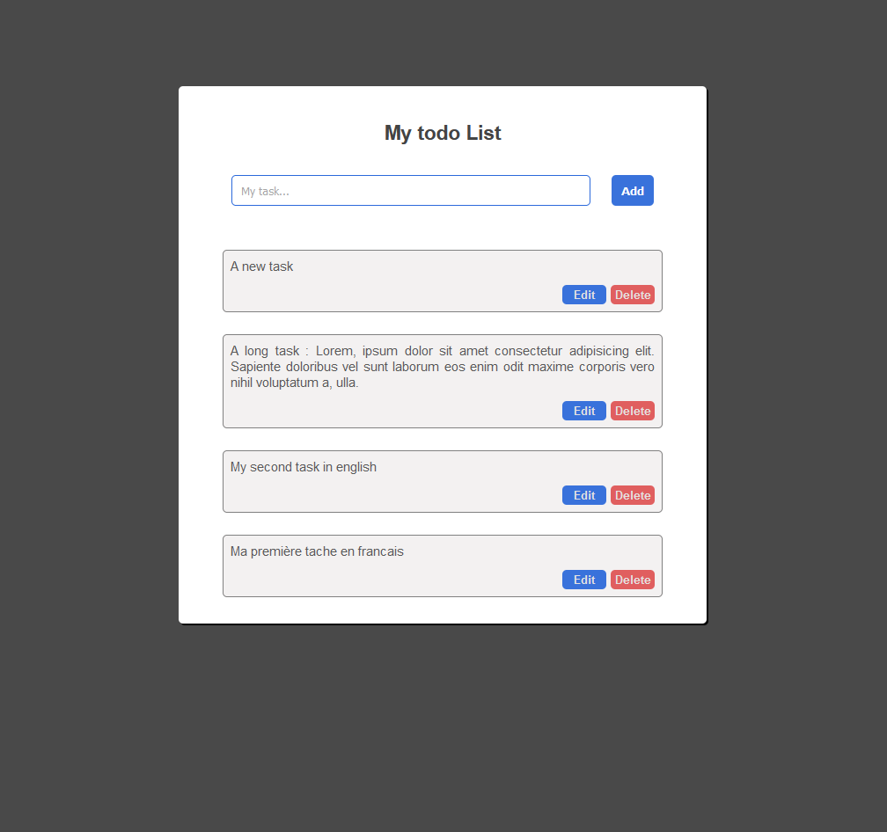

# React to-do-List 
---

A simple to-do-list built with React/ReactDom framework.

## Objectives :
---

This is my first project in React. The app can :

- add, edit and delete a task without reload.
- use a local API to render the app on your browser.
- use a local API to stock data on a JSON file (http://localhost:3003).

## How to use :
---

- You need to download all packages
- npm command (back) : npm run server 3003
- npm command (front) : npm run start
- Enjoy!

## Technologies used :
---

- HTML
- CSS
- Javascript
- React framework (react, react-dom)
- Axios (API)

